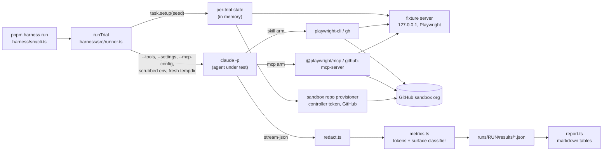

# cli-vs-mcp

[](https://github.com/chief-builder/cli-vs-mcp/actions/workflows/ci.yml)
[](LICENSE)

A TypeScript harness that runs the same task many times through **Claude Code** under three tool surfaces and measures
what changes: a **baseline** with no execution tools, a **skill** arm where Claude Code drives a CLI (`playwright-cli`,
`gh`) through a Skill, and an **mcp** arm where it uses an MCP server (`@playwright/mcp`, `github-mcp-server`). Each
trial runs `claude -p` in a fresh temp directory against per-trial synthetic state. The harness records the transcript,
token and time cost, and a success score. It also classifies every tool call as inside or outside the arm's intended
surface, so a trial that "passed" by escaping its tools is not counted as a clean pass.

Write-up and charts: <https://chief-builder.github.io/cli-vs-mcp/>

## Why it matters

"Should I wrap this tool as a CLI skill or an MCP server?" is usually argued from intuition. This harness turns it
into a controlled comparison: same prompt, same per-trial state, same model, with only the tool surface changing.
It reports both **cost** (tokens, turns, time) and **validity** (did the agent stay on the surface it was given). The
second turned out to matter as much as the first. CLI arms frequently reached the right answer through shell escapes
such as `base64 -d`, ad-hoc variables, and in one task borrowed credentials, which a success-only benchmark would
have counted as wins.

## Architecture



| Module | Responsibility |
|---|---|
| `harness/src/cli.ts` | Commands: `run`, `report`, `recompute-metrics`, `verify-arms`, `redact-artifacts`; argument validation |
| `harness/src/runner.ts` | One trial: temp dir, setup, fixture server, `claude` child with isolation flags and scrubbed env, success check, guaranteed cleanup |
| `harness/src/config.ts` | Defaults (model, timeout, tool lists) and validated GitHub configuration |
| `harness/src/experiment.ts` | `ExperimentSpec` / `ArmConfig` interfaces |
| `harness/src/experiments/{playwright,github}.ts` | Per-experiment arms, shell classifier, agent env, preflight |
| `harness/src/metrics.ts` | Stream-json parser and allow-list tool classifier |
| `harness/src/shell.ts` | Top-level shell segment parser used by the classifiers |
| `harness/src/redact.ts` | Removes home paths and out-of-trial file reads from artifacts |
| `harness/src/report.ts` | Aggregation and markdown report |
| `harness/src/fixtureServer.ts`, `trialState.ts` | Loopback HTTP fixtures and seeded per-trial state |
| `experiments/<name>/tasks/` | Task definitions (prompt, setup, success check, cleanup) |
| `experiments/github/provisioner.ts` | Controller-side GitHub REST helpers |

### How a trial is isolated

1. **Paired seed.** `sha256(experiment:run:task:trial)` (16 hex) drives all per-trial state, so every arm attempting
   trial 3 of a task sees the same data.
2. **Answers stay off disk.** Playwright pages are rendered from memory by a per-trial server on `127.0.0.1`. GitHub
   state lives in a private repo created by a controller token the agent never sees, and is deleted on cleanup.
3. **Positive tool list.** Each arm passes `claude --tools <list>`: baseline `Read Glob Grep Write ToolSearch`, skill
   `Skill Bash Write ToolSearch`, mcp `Write ToolSearch`. MCP tools come only from `--strict-mcp-config --mcp-config`.
   `WebFetch`, `WebSearch`, `Monitor`, `CronCreate` and `RemoteTrigger` are also on `--disallowed-tools`.
4. **File-tool confinement.** A `--settings` deny rule blocks `Read`/`Edit` under `~` and the repo, so an agent can't
   read the developer's files or other trials' results.
5. **Credential isolation.** Every inherited `GH_*`/`GITHUB_*` variable is removed (`extendEnv: false`), `gh` gets an
   empty per-trial `GH_CONFIG_DIR`, and the agent token is injected under the key each arm expects. The GitHub skill
   arm's Bash runs in Claude Code's OS sandbox with no unsandboxed fallback, which blocks the developer's keyring login
   and `$HOME` reads.
6. **Classification.** Each tool call is checked against the same per-arm list; Bash calls in the skill arm must consist
   only of the intended CLI (no pipes into helpers, no `$(...)`, no variable assignments).

`pnpm harness verify-arms --experiment <name>` starts each arm exactly like a trial and prints the tool list Claude
Code reports, and exits non-zero if anything outside the configured list is present.

## Quickstart

Prerequisites:

| Tool | Version | Needed for |
|---|---|---|
| Node.js | 24 (see `.nvmrc`) | everything |
| pnpm | 12 (`packageManager` in `package.json`; `corepack enable` or `npm i -g pnpm@12`) | everything |
| Claude Code CLI | logged in (`claude` on `PATH`) | `run`, `verify-arms` (each trial is a paid model call) |
| Docker | running | GitHub mcp arm |
| `gh` | any recent | GitHub skill arm |
| macOS or Linux (`bubblewrap` + `socat` on Linux) | | Claude Code's Bash sandbox (GitHub skill arm) |

```bash
git clone https://github.com/chief-builder/cli-vs-mcp.git
cd cli-vs-mcp
pnpm install
pnpm test                                   # no network, no Claude calls
pnpm exec playwright-cli install-browser    # first time on a machine

# Check arm isolation, then run one trial per arm (about 3 short Claude calls each)
pnpm harness verify-arms --experiment playwright
pnpm harness run --experiment playwright --run quickstart --arm skill --task tier1_scrape --trials 1
pnpm harness run --experiment playwright --run quickstart --arm mcp --task tier1_scrape --trials 1
pnpm harness report --experiment playwright --run quickstart
```

A full N=5 run of one experiment is several hundred `claude -p` calls. Budget accordingly.

### GitHub experiment

Create a dedicated sandbox org and three fine-grained PATs scoped to it, then put them in `.env` at the repo root
(gitignored and loaded automatically by `pnpm harness`):

```bash
GITHUB_SANDBOX_OWNER=my-sandbox-org
GITHUB_CONTROLLER_TOKEN=github_pat_...   # Administration, Contents, Issues, Pull requests, Workflows: write; Actions: read
GITHUB_AGENT_TOKEN=github_pat_...        # Tier 1: Contents, Issues, Pull requests, Actions: read (nothing else)
GITHUB_AGENT_TOKEN_RW=github_pat_...     # Tier 2: Contents, Issues, Pull requests: write; Actions: read; no Administration
```

```bash
docker pull ghcr.io/github/github-mcp-server@sha256:e3816a476a977cfb836e7d221510011436c654d11861db66ecfd826601aba6a4
pnpm harness verify-arms --experiment github
pnpm harness run --experiment github    --run myrun --arm skill --tier 1 --trials 5
# Tier 2 needs write access: override the agent token for that command only
GITHUB_AGENT_TOKEN="$(grep '^GITHUB_AGENT_TOKEN_RW=' .env | cut -d= -f2-)" \
  pnpm harness run --experiment github-rw --run myrun --arm mcp --tier 2 --trials 5
```

Every token needs resource owner = the sandbox org and repository access = all repositories (trials create new repos).
A variable already set in the shell takes precedence over `.env`.

Use a separate GitHub identity for the agent tokens if you can. Both committed runs used one user for all tokens.

## Configuration

| Setting | Where | Default | Notes |
|---|---|---|---|
| `GITHUB_SANDBOX_OWNER` | env / `.env` | required for GitHub | User or org that owns throwaway repos |
| `GITHUB_CONTROLLER_TOKEN` | env / `.env` | required for GitHub | Provisions and deletes repos; never passed to the agent |
| `GITHUB_AGENT_TOKEN` | env / `.env` | required for GitHub | Given to the agent as `GH_TOKEN`/`GITHUB_TOKEN` (skill) or `GITHUB_PERSONAL_ACCESS_TOKEN` (mcp). Read-only for Tier 1 |
| `GITHUB_AGENT_TOKEN_RW` | `.env` | optional | Not read by the harness; pass it as `GITHUB_AGENT_TOKEN` for Tier 2 runs |
| `GITHUB_HOST` | env / `.env` | `api.github.com` | API host for the provisioner; forwarded to the agent as `GH_HOST`/`GITHUB_HOST` |
| `LOG_FORMAT` | env | human | `json` for one JSON object per log line |
| `--model` | `run`, `verify-arms` | `claude-sonnet-4-6` | `DEFAULT_MODEL` in `harness/src/config.ts` |
| Trial timeout | `harness/src/config.ts` | 240 s | `TRIAL_TIMEOUT_MS` |
| Arm tool lists, sandbox hosts | `harness/src/experiments/*.ts` | see above | `ArmConfig.tools`, `sandboxNetwork` |
| MCP servers | `.mcp.playwright.json`, `.mcp.github.{ro,rw}.json` | pinned versions | `@playwright/mcp@0.0.75`; `github-mcp-server` v1.0.4 by digest |

Commands (`pnpm harness <cmd> --help` for details):

| Command | Required | Optional |
|---|---|---|
| `run` | `--experiment --run --arm --trials` | `--tier <1-3>` or `--task <id>`; `--model`; `--single-cli-command` |
| `report` | `--experiment --run` | `--tier` or `--all-tiers`; `--crossover-analysis`; `--single-cli-command`; `--include-cost`; `--output <path>` |
| `verify-arms` | `--experiment` | `--arm`; `--model` |
| `recompute-metrics` | `--experiment --run` | `--arm`; `--tier` (re-parses stored transcripts; use `github-rw --tier 2` for Tier 2 GitHub results) |
| `redact-artifacts` | | `--experiment` |

Results are written to `experiments/<exp>/runs/<run>/results/<arm>/<task>/<n>.json` with the transcript at
`.../transcripts/<arm>/<task>/<n>.jsonl`. Result fields are defined by `TrialResult` (`harness/src/runner.ts`) and
`Metrics` (`harness/src/metrics.ts`). A trial killed on timeout has `metrics.incomplete: true`, and its tokens are a
lower-bound estimate (`tokensEstimated: true`).

## Tasks

**Playwright** (`experiments/playwright/tasks/`): `tier1_login` (sign in, screenshot ≥ 1 KB), `tier1_scrape` (5-row
table to JSON), `tier1_form` (submit a form with a per-trial nonce), `tier1_products` (5 product pages to JSON),
`tier2_checkout` (find a product by marker, check out), `tier2_recovery` (read an inline error code and resubmit).

**GitHub** (`experiments/github/tasks/`): Tier 1 read-only: `tier1_repo_inventory`, `tier1_issue_triage`,
`tier1_pr_diff_answer`, `tier1_workflow_status`. Tier 2 (`--experiment github-rw`): `tier2_issue_workflow`,
`tier2_file_patch_pr`, `tier2_file_patch_pr_directed`, `tier2_issue_create`.

## Results

### Current run: `n5-v2` (2026-10-03)

N=5 per task for skill and mcp (baseline N=2), with Claude Code 2.1.288, `claude-sonnet-4-6`, the pinned tool versions
above, and the isolation described in [How a trial is isolated](#how-a-trial-is-isolated). Full tables and narrative:
[Playwright](experiments/playwright/runs/n5-v2/findings.md), [GitHub](experiments/github/runs/n5-v2/findings.md).
Token figures are total tokens averaged over trials that passed and stayed in surface.

- **MCP passed and stayed in surface on every task** (Playwright 30/30, GitHub 35/35).
- **MCP used fewer tokens on every task.** Skill cost 1.5–2.1× as much, except `tier1_form` at 2.67×, where the skill
  arm makes one `fill` call per field and MCP one `browser_fill_form`.
- **The CLI arm escapes when `gh` lacks the primitive.** Skill passed `tier1_repo_inventory` and `tier2_file_patch_pr`
  5/5 but stayed in surface **0/5** (`gh api … | base64 -d`; shell variables and `$(…)` to build the PUT body). It
  stayed in surface on every other task.
- **Naming the workaround in the prompt didn't fix it.** `tier2_file_patch_pr_directed`: 2/5 pass, 3/5 valid, **0/5
  both**. Passing trials used 2.63× the tokens of the undirected run; the three valid trials timed out in extended
  thinking.
- **Baseline** (no execution tools): 0/26.

| Playwright task | Skill/MCP tokens | | GitHub task (clean) | Skill/MCP tokens |
|---|---|---|---|---|
| `tier1_login` | 2.07× | | `tier1_issue_triage` | 1.67× |
| `tier1_scrape` | 1.54× | | `tier1_pr_diff_answer` | 1.71× |
| `tier1_form` | 2.67× | | `tier1_workflow_status` | 1.52× |
| `tier1_products` | 1.53× | | `tier2_issue_workflow` | 1.77× |
| `tier2_checkout` | 1.68× | | `tier2_issue_create` | 1.69× |
| `tier2_recovery` | 2.06× | | | |

One recorded skill failure on `tier2_issue_create` is a success-check false negative: the issue was created correctly,
but the check's list window was too short. The window has been widened, and the trial is kept as recorded.

### First run: `n5` (May 2026)

The first N=5 run used Claude Code 2.1.142–2.1.143 and looser isolation. `--allowed-tools` did not restrict tools, and
the environment scrub did not take effect. Its stored results were re-classified with the current classifier; see the
[Playwright](experiments/playwright/runs/n5/findings.md) and [GitHub](experiments/github/runs/n5/findings.md) findings.
How `n5-v2` differs:

- **`tier1_issue_triage` was not a valid comparison in `n5`.** The agent token lacked Issues read: MCP 0/5, and the skill
  arm passed only by using the controller token or the developer's own `gh` login. With a correctly scoped token, both
  arms solve it 5/5.
- **MCP `tier2_recovery`** went from 2/5 to 5/5.
- **Cost ratios rose.** They were 1.13–1.38× (GitHub) and 1.29–1.42× (Playwright, form 2.51×). Both arms got cheaper,
  MCP more so: each turn's fixed context fell (mcp ~12k → ~8.5k tokens, skill ~16.6k → ~13–15k). The tool restriction
  and the Claude Code upgrade changed at the same time, so treat the exact multiple as setup-specific. The direction (MCP
  cheaper) held in both runs.
- **Unchanged:** the `base64 -d` validity escapes on the same two tasks.

## Project status and limitations

This is a research harness, not a benchmark suite. Read the results with these limits in mind:

- **N=5 per cell.** Treat the ratios as directional rather than precise.
- **Two runs, two setups.** `n5-v2` uses the current isolation; `n5` predates it (see Results). Cost multiples differ
  between them; compare runs only with that in mind.
- **Experiment subjects are pinned on purpose.** These are `@playwright/cli` 0.1.13, `@playwright/mcp` 0.0.75,
  `github-mcp-server` v1.0.4 and model `claude-sonnet-4-6`. Newer versions exist, and upgrading them requires a new run.
  Claude Code itself is not pinned; record `claude --version` with any new run.
- **MCP protocol version.** The harness does not implement MCP; Claude Code is the client. The negotiated protocol
  version is not recorded. The current specification revision is 2026-07-28.
- **Same identity.** In both runs all GitHub tokens belonged to the same user. `n5-v2` used separate read-only (Tier 1)
  and read-write (Tier 2) agent tokens.
- **Sandbox coverage.** Only the GitHub skill arm runs Bash in the OS sandbox. The Playwright skill arm needs local
  browsers and a loopback server, so it relies on the classifier and file-tool deny rules.
- **File-tool reach.** Reads are denied under `~` and the repo, but not elsewhere (for example the user's `$TMPDIR`).
  Answers are never on disk, and such reads are redacted from artifacts; full confinement needs a container.
- **macOS sandbox setting.** The GitHub skill arm sets `enableWeakerNetworkIsolation` so `gh` can verify TLS (without
  it every `gh` call fails with `x509: OSStatus -26276`). The keychain and `$HOME` stay blocked; this was tested.
- **Timeouts.** Token counts for killed trials are lower bounds (streamed output tokens are partial and side-model calls
  are missing).

## Development

```bash
pnpm test            # vitest: unit + integration (fake claude), no network
pnpm test:coverage   # with v8 coverage
pnpm lint            # eslint
pnpm format:check    # prettier
pnpm typecheck       # tsc --noEmit
pnpm check           # all of the above
```

To add an experiment, create `harness/src/experiments/<name>.ts` exporting an `ExperimentSpec` (arms with `tools`,
`mcpConfig`, optional `sandboxNetwork`/`extraEnv`; a classifier; `tasksPath`; optional `preflight`/`buildAgentEnv`),
register it in `harness/src/experiments/index.ts`, add tasks under `experiments/<name>/tasks/`, bundle any skill under
`.claude/skills/<skill>/`, and run `verify-arms`. The harness is shared; don't fork it per experiment. See
[CONTRIBUTING.md](CONTRIBUTING.md).

## License

[MIT](LICENSE). `.claude/skills/playwright-cli/` is adapted from `@playwright/cli` (Apache-2.0); see [NOTICE](NOTICE).
